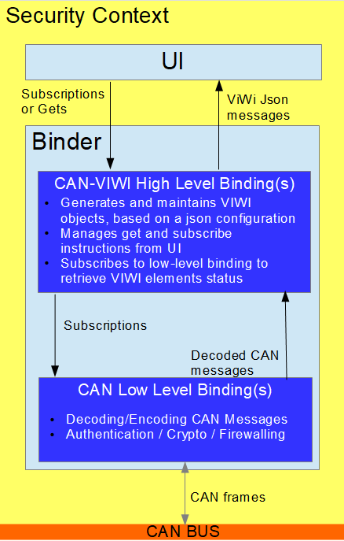

# AGL VIWI HIGH-CAN binding architecture

This binding is intended to act between low-level binding(s) and clients. It builds ViWi resources as defined in a json configuration file, and implements subscribe/unsubscribe/get verbs for the clients. Each ViWi resource can be composed of several elements, for which subscriptions will be made to the low-level binding with configurable frequencies or filters.

<!-- pagebreak -->

## BRIEF VIWI DESCRIPTION

ViWi (Volkswagen Infotainment Web Interface) protocol defines a serie of objects, which can be queried or updated via JSon messages.

Each object is assigned with a unique URI.

The depth of the URI tree is limited to 3, i.e. /service/resource>/element/, for instance **/car/doors/3901a278-ba17-44d6-9aef-f7ca67c04840**.

To retrieve the list of elements for a given resource, one can use the get command, for instance **get /car/doors/**.

It is also possible to subscribe to elements or group of elements, for instance **subscribe /car/doors/3901a278-ba17-44d6-9aef-f7ca67c04840**. Requests can also have various filters, or specify a frequency.

More details in the [ViWi general documentation](https://www.w3.org/Submission/viwi-protocol/) and in the [ViWi.service.car documentation](https://www.w3.org/Submission/viwi-service-car/)
